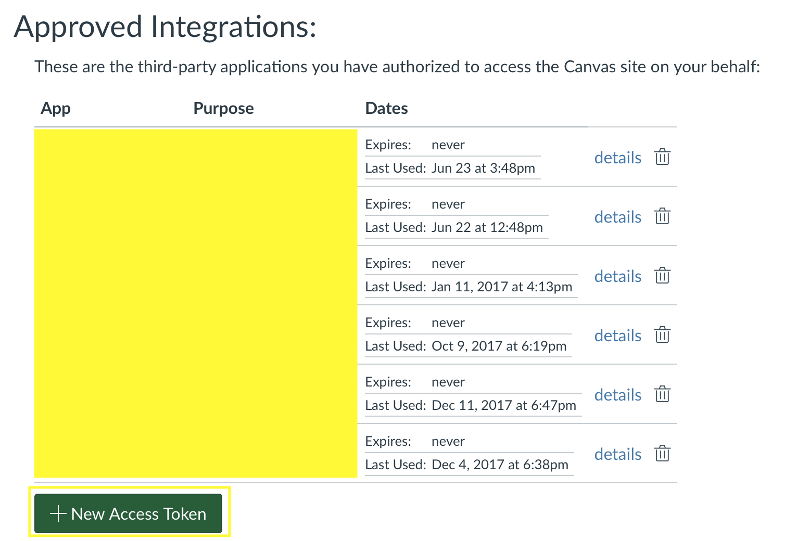

# Canvas File Sync

When using Canvas, I found that constantly downloading new files, updated files and then organizing those files was a huge pain. This program aims to work by having Google Drive like functionality with Canvas so that you never have to worry about being up to date or how you have organized things, because they will be organized on your computer just as they are organized on Canvas.

## Getting Started

CFS uses a user generated token to authorize itself to download files on your behalf. To get this token you need to login to Canvas.

Once logged in, click on your `icon`.

Click on `settings`

Scroll down to this section and click `New Token`

Write a small purpose(doesn't matter what it says) and click `Generate Token`

Copy the following highlighted token(don't share it with anyone)

## Installing CFS

Installing CFS should behave as any normal program and following it's installation you should see the following logo in your top `menubar` on Mac and bottom `tray` on Windows.

Click the `icon` then click `Connect`

Fill out the form when this screen appears.

The `School` field is what appears before `.instructure.com` in your browser when you are logged into Canvas.

The `Developer Key` is what you just copied.

The `Sync Directory` is where you would like your course files to be synced.

After clicking `Sync`, check the folder you chose and your files should be there.
